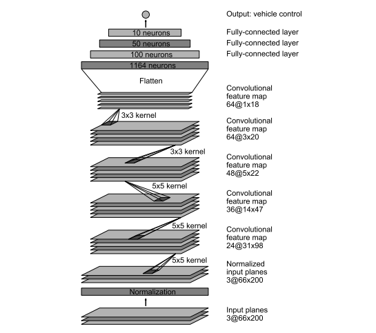

# Udacity's Self-Driving Car Nanodegree Program
## Project 3 - Behavioral Cloning
### _How to Train a Deep Neural Network to Drive a Simulated Car_ 
This project builds and implements a behavioral cloning (end-to-end) network that drives a simulated autonomous vehicle around two different test tracks. The first track is used to generate data that the car will use to react and recover in changing road conditions. The second track is used to test the model's performance and ensure that it is not overfitting the data after training.

**"TRAINING MODE"** is used to collect data on the simulator for several laps and automatically saves data to **driving_log.csv**.
**"AUTONOMOUS MODE"** Driving simulation is accomplished by running the car's drive server using the following code from the Terminal after a cd into the project's directory:

#### $ python drive.py model.json

The first track, shown below, is used to record data and validate the model after training.

The following naming conventions have been used in this project:

+ **model.py** - The script used to create and train the model. SDCND_P3_Hiddink.ipynb serves as the de facto model.py script in this implementation. This allowed the use of Jupyter notebooks and made up-front code writing more straightforward.

+ **drive.py** - The script to drive the car. The original file was kept largely the same, with the exception of a crop function. The script is in the home directory as drive.py.

+ **model.json** - The model architecture. The **archive** folder contains the historical versions of the model, model.json, that were created throughout this project's development.

+ **model.h5** - The model weights. The **archive** folder contains the historical versions of the model's weights, model.h5, that were created throughout this project's development.

+ **README.md** - explains the structure of your network and training approach. This is the **README.md** file.

### Model Architecture

The graph above shows the NVIDIA model architecture described in a recent paper published here: https://arxiv.org/pdf/1604.07316v1.pdf 

This project was largely inspired by the NVIDIA architecture, in addition to other successful implementations of Convolutional Neural Networks on GitHub, such as comma.ai (https://github.com/commaai/research) and student repos by ksakmann (https://github.com/ksakmann/CarND-BehavioralCloning/) and diyjac (https://github.com/diyjac/SDC-P3). 

Although slightly different in their approaches, each of the models mentioned above have the same thing in common: the data that they were supplied was heavily augmented in several ways in order to increase the model's exposure to changing road conditions. This project draws heavily on these techniques, and attempts to combine them for increased performance.

The model is built using the Keras library and is a Convolutional Neural Network (CNN) with four convolutional layers. The sizes of each layer were chosen to decrease the kernel size by a factor of 2 after each convolution. ReLu activations are used throughout the model, and two dropout layers help to reduce the tendancy toward overfitting.

### Training the Model (model.py)

Below is the second track available in the simulator. Once the model is trained, this track used to verify performance on new terrain.

The model was trained in the SDCND_P3_Hiddink.ipynb jupyter notebook using the model described above. Unfortunately, data input was limited due to several factors, including, but not limited to, the following:
+ The data collected via keyboard input was too "choppy", i.e. it did not acutely record the correct maneuvers the model should make to recover from the edges of the road.
+ A joystick was not available to collect driving data.

As a result, it became necessary to augment the data set provided by Udacity using several techniques, as shown below.
Original Sample:

+ Shearing

+ Cropping

+ Flipping

+ Adjusting Brightness 

Each of these techniques were used to increase the overall size of the data set to give the model more material to learn.

#### Final Results
Here are the final results of the project:

#### Further plans
In the future, I hope to improve upon the data augmentation techniques to increase performance in shadows. Additionally, I could to add additional tracks to the simulator and possibly implement lane detection using OpenCV. 

One project on GitHub that has inspired me further is TensorKart by Kevin Hughes (https://github.com/kevinhughes27/TensorKart). I am interested in contributing further to his work, possibly using some of the code that was developed in this project.

