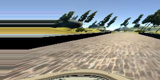

<<<<<<< HEAD
<<<<<<< HEAD
<<<<<<< HEAD
<<<<<<< HEAD
<<<<<<< HEAD
<<<<<<< HEAD
<<<<<<< HEAD
<<<<<<< HEAD
<<<<<<< HEAD
# SDCND_Portfolio_Hiddink
=======
#**Finding Lane Lines on the Road** 


When we drive, we use our eyes to decide where to go.  The lines on the road that show us where the lanes are act as our constant reference for where to steer the vehicle.  Naturally, one of the first things we would like to do in developing a self-driving car is to automatically detect lane lines using an algorithm.

In this project you will detect lane lines in images using Python and OpenCV.  OpenCV means "Open-Source Computer Vision", which is a package that has many useful tools for analyzing images.  

**Step 1:** Getting setup with Python

To do this project, you will need Python 3 along with the numpy, matplotlib, and OpenCV libraries, as well as Jupyter Notebook installed. 

We recommend downloading and installing the Anaconda Python 3 distribution from Continuum Analytics because it comes prepackaged with many of the Python dependencies you will need for this and future projects, makes it easy to install OpenCV, and includes Jupyter Notebook.  Beyond that, it is one of the most common Python distributions used in data analytics and machine learning, so a great choice if you're getting started in the field.

Choose the appropriate Python 3 Anaconda install package for your operating system <A HREF="https://www.continuum.io/downloads" target="_blank">here</A>.   Download and install the package.

If you already have Anaconda for Python 2 installed, you can create a separate environment for Python 3 and all the appropriate dependencies with the following command:

`>  conda create --name=yourNewEnvironment python=3 anaconda`

`>  source activate yourNewEnvironment`

**Step 2:** Installing OpenCV

Once you have Anaconda installed, first double check you are in your Python 3 environment:

`>python`    
`Python 3.5.2 |Anaconda 4.1.1 (x86_64)| (default, Jul  2 2016, 17:52:12)`  
`[GCC 4.2.1 Compatible Apple LLVM 4.2 (clang-425.0.28)] on darwin`  
`Type "help", "copyright", "credits" or "license" for more information.`  
`>>>`   
(Ctrl-d to exit Python)

run the following command at the terminal prompt to get OpenCV:

`>  conda install -c https://conda.anaconda.org/menpo opencv3`

then to test if OpenCV is installed correctly:

`> python`  
`>>> import cv2`  
`>>>`  
(Ctrl-d to exit Python)

**Step 3:** Installing moviepy  

We recommend the "moviepy" package for processing video in this project (though you're welcome to use other packages if you prefer).  

To install moviepy run:

`>pip install moviepy`  

and check that the install worked:

`>python`  
`>>>import moviepy`  
`>>>`  
(Ctrl-d to exit Python)

**Step 4:** Opening the code in a Jupyter Notebook

You will complete this project in a Jupyter notebook.  If you are unfamiliar with Jupyter Notebooks, check out <A HREF="https://jupyter-notebook-beginner-guide.readthedocs.io/en/latest/" target="_blank">this link</A> to get started.

Jupyter is an ipython notebook where you can run blocks of code and see results interactively.  All the code for this project is contained in a Jupyter notebook. To start Jupyter in your browser, run the following command at the terminal prompt (be sure you're in your Python 3 environment!):

`> jupyter notebook`

A browser window will appear showing the contents of the current directory.  Click on the file called "P1.ipynb".  Another browser window will appear displaying the notebook.  Follow the instructions in the notebook to complete the project.  
>>>>>>> CarND_P1_Finding_Lane_Lines/master
=======
# Self-Driving Car Engineer Nanodegree
# Deep Learning
## Project: Build a Traffic Sign Recognition Program

### Overview

In this project, you will use what you've learned about deep neural networks and convolutional neural networks to classify traffic signs. You will train a model so it can decode traffic signs from natural images by using the [German Traffic Sign Dataset](http://benchmark.ini.rub.de/?section=gtsrb&subsection=dataset). After the model is trained, you will then test your model program on new images of traffic signs you find on the web, or, if you're feeling adventurous pictures of traffic signs you find locally!

### Dependencies

This project requires **Python 3.5** and the following Python libraries installed:

- [Jupyter](http://jupyter.org/)
- [NumPy](http://www.numpy.org/)
- [SciPy](https://www.scipy.org/)
- [scikit-learn](http://scikit-learn.org/)
- [TensorFlow](http://tensorflow.org)

Run this command at the terminal prompt to install [OpenCV](http://opencv.org/). Useful for image processing:

- `conda install -c https://conda.anaconda.org/menpo opencv3`

### Dataset

1. Download the dataset. You can download the pickled dataset in which we've already resized the images to 32x32 [here](https://d17h27t6h515a5.cloudfront.net/topher/2016/October/580d53ce_traffic-sign-data/traffic-sign-data.zip).
 
2. Clone the project and start the notebook.
```
git clone https://github.com/udacity/traffic-signs
cd traffic-signs
jupyter notebook Traffic_Signs_Recognition.ipynb
```
3. Follow the instructions in the `Traffic_Signs_Recognition.ipynb` notebook.

>>>>>>> CarND_P2_Traffic_Sign_Classifier/master
=======

# Udacity's Self-Driving Car Nanodegree Program
## Project 3 - Behavioral Cloning
### _How to Train a Deep Neural Network to Drive a Simulated Car_ 
This project builds and implements a behavioral cloning (end-to-end) network that drives a simulated autonomous vehicle around two different test tracks. The first track is used to generate data that the car will use to react and recover in changing road conditions. The second track is used to test the model's performance and ensure that it is not overfitting the data after training.


**"TRAINING MODE"** is used to collect data on the simulator for several laps and automatically saves data to **driving_log.csv**.
**"AUTONOMOUS MODE"** Driving simulation is accomplished by running the car's drive server using the following code from the Terminal after a cd into the project's directory:

#### $ python drive.py model.json

The first track, shown below, is used to record data and validate the model after training.


The following naming conventions have been used in this project:

+ **model.py** - The script used to create and train the model. SDCND_P3_Hiddink.ipynb serves as the de facto model.py script in this implementation. This allowed the use of Jupyter notebooks and made up-front code writing more straightforward.

+ **drive.py** - The script to drive the car. The original file was kept largely the same, with the exception of a crop function. The script is in the home directory as drive.py.

+ **model.json** - The model architecture. The **archive** folder contains the historical versions of the model, model.json, that were created throughout this project's development.

+ **model.h5** - The model weights. The **archive** folder contains the historical versions of the model's weights, model.h5, that were created throughout this project's development.

+ **README.md** - explains the structure of your network and training approach. This is the **README.md** file.

### Model Architecture


The graph above shows the NVIDIA model architecture described in a recent paper published here: https://arxiv.org/pdf/1604.07316v1.pdf 

This project was largely inspired by the NVIDIA architecture, in addition to other successful implementations of Convolutional Neural Networks on GitHub, such as comma.ai (https://github.com/commaai/research) and student repos by ksakmann (https://github.com/ksakmann/CarND-BehavioralCloning/) and diyjac (https://github.com/diyjac/SDC-P3). 

Although slightly different in their approaches, each of the models mentioned above have the same thing in common: the data that they were supplied was heavily augmented in several ways in order to increase the model's exposure to changing road conditions. This project draws heavily on these techniques, and attempts to combine them for increased performance.

The model is built using the Keras library and is a Convolutional Neural Network (CNN) with four convolutional layers. The sizes of each layer were chosen to decrease the kernel size by a factor of 2 after each convolution. ReLu activations are used throughout the model, and two dropout layers help to reduce the tendancy toward overfitting.

### Training the Model (model.py)

Below is the second track available in the simulator. Once the model is trained, this track used to verify performance on new terrain.

The model was trained in the SDCND_P3_Hiddink.ipynb jupyter notebook using the model described above. Unfortunately, data input was limited due to several factors, including, but not limited to, the following:
+ The data collected via keyboard input was too "choppy", i.e. it did not acutely record the correct maneuvers the model should make to recover from the edges of the road.
+ A joystick was not available to collect driving data.

As a result, it became necessary to augment the data set provided by Udacity using several techniques, as shown below.
Original Sample:


+ Shearing


+ Cropping


+ Flipping


+ Adjusting Brightness 


Each of these techniques were used to increase the overall size of the data set to give the model more material to learn.

#### Final Results
Here are the final results of the project:

[](https://www.youtube.com/watch?v=kuUtfNDPWpY)

#### Further plans
In the future, I hope to improve upon the data augmentation techniques to increase performance in shadows. Additionally, I could to add additional tracks to the simulator and possibly implement lane detection using OpenCV. 

One project on GitHub that has inspired me further is TensorKart by Kevin Hughes (https://github.com/kevinhughes27/TensorKart). I am interested in contributing further to his work, possibly using some of the code that was developed in this project.

[](https://www.youtube.com/watch?v=vrccd3yeXnc)
>>>>>>> CarND_P3_Behavioral_Cloning/master
=======
[//]: # (Image References)
[loading_screen]: https://github.com/nhiddink/CarND_P4_Advanced_Lane_Finding/blob/master/Resources/Screenshots/loading_screen.png
[distortion]: https://github.com/nhiddink/CarND_P4_Advanced_Lane_Finding/blob/master/resources/output_images/distortion.png
[distortion_theory]: https://github.com/nhiddink/CarND_P4_Advanced_Lane_Finding/blob/master/Resources/Screenshots/distortion.png
[corners_unwarp]: https://github.com/nhiddink/CarND_P4_Advanced_Lane_Finding/blob/master/resources/output_images/corners_unwarp.png
[distortion_corrected]: https://github.com/nhiddink/CarND_P4_Advanced_Lane_Finding/blob/master/resources/output_images/undistorted.png
[sobel_x]: https://github.com/nhiddink/CarND_P4_Advanced_Lane_Finding/blob/master/resources/output_images/sobel_x.png
[sobel_y]: https://github.com/nhiddink/CarND_P4_Advanced_Lane_Finding/blob/master/resources/output_images/sobel_y.png
[gradient_magnitude]: https://github.com/nhiddink/CarND_P4_Advanced_Lane_Finding/blob/master/resources/output_images/gradient_magnitude.png
[gradient_direction]: https://github.com/nhiddink/CarND_P4_Advanced_Lane_Finding/blob/master/resources/output_images/gradient_direction.png 
[color_thresholds]: https://github.com/nhiddink/CarND_P4_Advanced_Lane_Finding/blob/master/resources/output_images/color_thresholds.png 
[multiple_thresholds]: https://github.com/nhiddink/CarND_P4_Advanced_Lane_Finding/blob/master/resources/output_images/thresholded_binary.png
[region_masked]: https://github.com/nhiddink/CarND_P4_Advanced_Lane_Finding/blob/master/resources/output_images/region_masked.png
[perspective_transform]: https://github.com/nhiddink/CarND_P4_Advanced_Lane_Finding/blob/master/resources/output_images/perspective_transform.png
[sliding_windows]: https://github.com/nhiddink/CarND_P4_Advanced_Lane_Finding/blob/master/resources/output_images/sliding_windows.png
[shaded_lanes]: https://github.com/nhiddink/CarND_P4_Advanced_Lane_Finding/blob/master/resources/output_images/shaded_lanes.png
[lane_mapping]: https://github.com/nhiddink/CarND_P4_Advanced_Lane_Finding/blob/master/resources/output_images/lane_mapping.png

![alt text][loading_screen]
## Udacity's Self-Driving Car Nanodegree Program
### Project 4 - Advanced Lane Finding

---

This project utilizes several computer vision algorithms and techniques to perform advanced lane finding on test images and video streams. There are several steps involved in this process, including: 

* Computing the camera calibration matrix and distortion coefficients given a set of chessboard images.
* Applying a distortion correction to raw images.
* Using color transforms, gradients, etc., to create a thresholded binary image.
* Appling a perspective transform to rectify binary image ("birds-eye view").
* Detecting lane pixels and fit to find the lane boundary.
* Determining the curvature of the lane and vehicle position with respect to center.
* Warping the detected lane boundaries back onto the original image.
* Outputing the visual display of the lane boundaries and numerical estimation of lane curvature and vehicle position.

###Camera Calibration

The code for this step is contained in Sections I & II of SDCND_P4_Hiddink.ipynb.  

![alt text][distortion]

First, I define "object points", which represent the (x, y, z) coordinates of the chessboard corners in the world. I assume that the chessboard is fixed on the (x, y) plane at z=0, such that the object points are the same for each calibration image.  Thus, `objp` is just a replicated array of coordinates, and `objpoints` is appended with a copy of it every time I successfully detect all chessboard corners in a test image.  `imgpoints` is appended with the (x, y) pixel position of each of the corners in the image plane with each successful chessboard detection.  

![alt text][distortion_theory]

From there, I used the output `objpoints` and `imgpoints` to compute the camera calibration and distortion coefficients using the `cv2.calibrateCamera()` function.  I applied this distortion correction to the test image using the `cv2.undistort()` function and obtained this result: 

![alt text][corners_unwarp]

Here are the results of distortion correction on each of the test images (located in the test_images folder):

![alt text][distortion_corrected]

---

###Pipeline (Images)

![alt text][multiple_thresholds]

The example above displays the results of multiple thresholds on each test image in the test_images folder. Section III of the code explains this process step-by-step, with examples of each individual threshold. In order, the thresholding used on the images is as follows:

+ Color Channel HLS & HSV Thresholding - I extract the S-channel of the original image in HLS format and combine the result with the extracted V-channel of the original image in HSV format.

![alt text][color_thresholds]

+ Binary X & Y - I use Sobel operators to filter the original image for the strongest gradients in both the x-direction and the y-direction.

![alt text][sobel_x]
![alt text][sobel_y]

Next, I used techniques from "Project 1 - Finding Lane Lines" to conduct sanity checks. These techniques included Region Masking & Hough Lines, and the purpose for performing them was to ensure that the thresholding steps I took were accurate enough to yield proper perspective transforms.

The region masking results are shown below. I chose to limit the mask to a region with the following points: 

| Point       | Value                                    | 
|:-----------:|:----------------------------------------:| 
| Upper Left  | (image width x 0.4, image height x 0.65) | 
| Upper Right | (image width x 0.6, image height x 0.65) |
| Lower Right | (image width, image height)              |
| Lower Left  | (0, image height)                        |

![alt text][region_masked]

The code for my perspective transform is performed in a function I created called perspective_transform. The function takes in a thresholded binary image and source points, with the source points coinciding with the region masking points explained in the region masking table above. For destination points, I chose the outline of the image being transformed. Here are the results of the transforms:

![alt text][perspective_transform]

The next step after transforming the perspective was to detect lane-line pixels and to fit their positions using a polynomial in Section V of my code. After developing functions for sliding_windows and shaded_lanes, I was able to detect the lanes and yield the following results:

Sliding Windows Technique:
![alt text][sliding_windows]

Shaded Lanes Technique:
![alt text][shaded_lanes]

After detecting the lanes I needed to calculate the radius of curvature for each of the polynomial fits that I performed. The results of these calculations are shown in the table below. I used the radius of curvature example code from Udacity's lessons to create the calculation cells.

| Test Image | Radius of Curvature (Left) | Radius of Curvature (Right) | 
|:----------:|:--------------------------:|:---------------------------:| 
| test1.png  | 2985.467894 meters         | 2850.142018 meters          | 
| test2.png  | 4984.505982 meters         | 12357.329365 meters         |
| test3.png  | 10088.084712 meters        | 2363.421967 meters          |
| test4.png  | 9894.520013 meters         | 2366.846436 meters          |
| test5.png  | 2548.327638 meters         | 6124.849321 meters          |
| test6.png  | 4173.313472 meters         | 45794.832663 meters         |

Another calculation performed was the offset from the lane's center. The calculations are shown in the code cell following the radius of curvature, and yielded the following:

| Test Image | Offset from Center |
|:----------:|:------------------:| 
| test1.png  | 1.020143 meters    |
| test2.png  | 0.901214 meters    |
| test3.png  | 0.935571 meters    |
| test4.png  | 1.123214 meters    |
| test5.png  | 0.930286 meters    |
| test6.png  | 1.070357 meters    |

Finally, I plotted the warped images back down onto the road such that, for each image, the lane area is identified clearly:

![alt text][lane_mapping]

---

### Pipeline (Video)

Click on the image or link below to view the video results of the project.

### P4_video_final.mp4
https://youtu.be/5ZKbpNY-rok

<a href="http://www.youtube.com/watch?feature=player_embedded&v=5ZKbpNY-rok
" target="_blank"></a>

### 

=======
[//]: # (Image References)
[color_classification]: https://github.com/nhiddink/CarND_P5_Vehicle_Detection_and_Tracking/blob/master/resources/output_images/color_classification.png
[color_distribution_visualization]: https://github.com/nhiddink/CarND_P5_Vehicle_Detection_and_Tracking/blob/master/resources/output_images/color_distribution_visualization.png
[color_histograms_visualization]: https://github.com/nhiddink/CarND_P5_Vehicle_Detection_and_Tracking/blob/master/resources/output_images/color_histograms_visualization.png
[data_visualization]: https://github.com/nhiddink/CarND_P5_Vehicle_Detection_and_Tracking/blob/master/resources/output_images/data_visualization.png
[distortion]: https://github.com/nhiddink/CarND_P5_Vehicle_Detection_and_Tracking/blob/master/resources/screenshots/distortion.png
[gradient_visualization]: https://github.com/nhiddink/CarND_P5_Vehicle_Detection_and_Tracking/blob/master/resources/output_images/gradient_visualization.png
[heatmap]: https://github.com/nhiddink/CarND_P5_Vehicle_Detection_and_Tracking/blob/master/resources/output_images/heatmap.png
[hog_classification]: https://github.com/nhiddink/CarND_P5_Vehicle_Detection_and_Tracking/blob/master/resources/output_images/hog_classification.png
[hog_visualization]: https://github.com/nhiddink/CarND_P5_Vehicle_Detection_and_Tracking/blob/master/resources/output_images/hog_visualization.png
[loading_screen]: https://github.com/nhiddink/CarND_P5_Vehicle_Detection_and_Tracking/blob/master/resources/screenshots/loading_screen.png
[one_box_per_car]: https://github.com/nhiddink/CarND_P5_Vehicle_Detection_and_Tracking/blob/master/resources/output_images/one_box_per_car.png
[random_image_visualization]: https://github.com/nhiddink/CarND_P5_Vehicle_Detection_and_Tracking/blob/master/resources/output_images/random_image_visualization.png
[sliding_windows]: https://github.com/nhiddink/CarND_P5_Vehicle_Detection_and_Tracking/blob/master/resources/output_images/sliding_windows.png
[spatial_binning_visualization]: https://github.com/nhiddink/CarND_P5_Vehicle_Detection_and_Tracking/blob/master/resources/output_images/spatial_binning_visualization.png
[undistorted]: https://github.com/nhiddink/CarND_P5_Vehicle_Detection_and_Tracking/blob/master/resources/output_images/undistorted.png
[undistorted_and_warped]: https://github.com/nhiddink/CarND_P5_Vehicle_Detection_and_Tracking/blob/master/resources/output_images/undistorted_and_warped.png

[](http://www.udacity.com/drive)
## Udacity's Self-Driving Car Nanodegree Program
### Project 5 - Vehicle Detection and Tracking

---

The software pipeline in SDCND_P5_Hiddink.ipynb is written to detect vehicles in a video stream. To accomplish this, the following steps were performed:
+ **Camera Calibration** - correct distortion due to the camera lens that was used to record the test videos. 
+ **Data Visualization** - understand the labeled data set as two labeled groups, "cars" and "not-cars".
+ **Feature Extraction** - apply five techniques, including histograms of color, color distribution, spatial binning, gradient magnitude, and Histogram of Oriented Gradients (HOG), on the labeled training set of images to create a feature vector.
+ **Preprocessing Data** - normalize, randomize, and split the labeled data into a training set, a validation set, and a testing set.
+ **Training** -  train a Linear SVM classifier on the labeled training set
+ **Sliding Windows** - implement a technique to search an image for vehicles using the trained classifier, and optimize the algorithm's efficiency by limiting the search area of the image and/or using heat maps that reject outliers of the positive windows.
+ **Video** - run a function using moviepy that estimates a bounding box for detected vehicles frame by frame.

Each of these steps is described in detail below.

---

### Camera Calibration

The code for this step is contained in Section I of SDCND_P5_Hiddink.ipynb.

![undistorted]

In order to account for distortion, the camera used to record the project video and shoot the test images needs to be calibrated. To do this, a series of chessboard images were introduced that displayed varying distortion angles. 

![distortion]

First, I define "object points", which represent the (x, y, z) coordinates of the chessboard corners in the world. I assume that the chessboard is fixed on the (x, y) plane at z=0, such that the object points are the same for each calibration image. Thus, objp is just a replicated array of coordinates, and objpoints is appended with a copy of it every time I successfully detect all chessboard corners in a test image. imgpoints is appended with the (x, y) pixel position of each of the corners in the image plane with each successful chessboard detection.

![undistorted_and_warped]

From there, I used the output objpoints and imgpoints to compute the camera calibration and distortion coefficients using the cv2.calibrateCamera() function. I applied this distortion correction to the test image using the cv2.undistort() function and obtained the result shown above. After successfully warping chessboard images, I was able to apply the undistort function to the test images and videos using a pickle file that stored the distortion matrix.

---

### Data Visualization

The following is a visualization of the first 10 images in the labeled dataset:

![data_visualization]

Each image is defined with either a "car" or "not-car" label. The labeled data sets used in this project are originally from the GTI Vehicle Image Database [GTI Vehicle Image Database](http://www.gti.ssr.upm.es/data/Vehicle_database.html), augmented by examples extracted from the project video itself. In the future, this repository will include images from the [KITTI Vision Benchmark Suite](http://www.cvlibs.net/datasets/kitti/) and the ecently released [Udacity Labeled Dataset](https://github.com/udacity/self-driving-car/tree/master/annotations), as described in the Future Plans section below.

---

### Feature Extraction

Several different techniques for feature extraction were used in Section 2 of  this project, including histograms of color, color distribution, spatial binning, gradient magnitude, and Histogram of Oriented Gradients (HOG). Each has its own effect on the feature vector that is produced, and when combined the techniques tend to improve the chosen classifier's performance.

**Histograms of Color**

Histograms of color are used to analyze the raw pixel intensities of each color channel as features in the image. Given an image in RGB color space, color histograms of features return a concatenated feature vector based on the number of intensity bins and pixel intensity ranges.

![color_histograms_visualization]


**Color Distribution**

Color distribution maps are useful in studying color values and locating clusters of color that correspond to objects of interest in an image. When plotting these maps in 3D, often the color distribution of objects of interest is conveniently clustered along a plane.

![color_distribution_visualization]

**Spatial Binning**

Raw pixel values are useful to include in the feature vector when the desired objects in an image remain identifiable at low image resolutions, such as a car object.

![spatial_binning_visualization]

**Gradient Magnitude**

Gradient magnitude is a technique used in previous computer vision projects (Projects 1 & 4) that applies a filter that represents the magnitude of the sobel-x and sobel-y gradients of odd-numbered pixel squares, such as 3x3 or 5x5.

![gradient_visualization]

**Histogram of Oriented Gradients (HOG)**

HOG feature extraction is the most important technique utilized in this project. The scikit-image package has a built in function to handle HOG extraction, which is tuned by parameters including orientations, pixels_per_cell, and cells_per_block.

![hog_visualization]

The final feature extraction method that was implemented includes color histograms, spatial binning, and HOG, as shown in Sections 2 & 3. For HOG, the parameters were chosen as follows:

| Parameter       | Value   |
|:---------------:|:-------:| 
| orientations    | 9       |                                                                                 
| pixels_per_cell | (16,16) |
| cells_per_block | (4,4)   |
| visualise       | True    |
| feature_vector  | False   |

I chose these parameters for HOG after trial and error on test4.jpg. As shown in the visualization above, the parameters optimize the gradients, and work well for the heat map step later in the pipeline that limits the false positive classifications.

---

### Preprocessing Data

The training data was normalized, randomized, and split into training and testing sets, with 20% of the data reserved for the testing set.

---

### Training the SVC Classifier

After exploring feature extraction techniques, I trained a SVC classifier to classify the dataset as "car" or "not-car". On a consistent basis, the accuracy for this classifier was above 94%. To do this, I analyzed two different feature vectors and ran them through the classfier to produce the following results:

**Classification by Color and Spatial Binning**
![color_classification]

**Classification by HOG**
![hog_classification]

After comparing these two results, I decided to encorporate both of them as one feature vector that I retrained prior to running sliding windows on the test image, as explained next.

---

### Sliding Windows Search

![sliding_windows]

Section 3 of SDCND_P5_Hiddink.ipynb outlines my sliding windows approach to searching for vehicles in a test image with my SVC classifier. I decided to leave the scale at 1, but found that it performed well. I limited the search area to the bottom half of the image, minus the bottom 10%, for a total of 40% of the image to lower the total number of windows I needed to make. The parameters I chose for the sliding windows themselves are as follows: 

| Parameter  | Value             |
|:----------:|:-----------------:| 
| y_start    | image width x 0.5 |  
| y_stop     | image width x 0.9 |
| xy_window  | (64,64)           |
| xy_overlap | (0.85, 0.85)      |

These parameters produced the following results:

![positive_window_detections]

The overlap of 0.85 allowed for a strong signature of positive window values on the actual cars that simplified the process of ruling out false positives with heat maps, as shown in the image below:

![heatmap]

After recording the positions of positive detections in each frame of the video, I created a heatmap and thresholded it to identify vehicle positions. I then used `scipy.ndimage.measurements.label()` to identify individual blobs in the heatmap. 

Assuming each cluster of positive windows corresponded to a vehicle, I constructed bounding boxes to cover the area of each blob detected. After detecting the correct amount of cars, I was able to combine the positive bounding boxes into one bounding box for each car:

![one_box_per_car]

---

### Video

A link to the final video output for this project is provided below. The code pipeline performs reasonably well on the entire video.

### P5_project_video_final.mp4
https://youtu.be/Vx5GtROunzQ

<a href="http://www.youtube.com/watch?feature=player_embedded&v=Vx5GtROunzQ
" target="_blank"></a>

>>>>>>> CarND_P5_Vehicle_Detection_and_Tracking/master
---

### Discussion

<<<<<<< HEAD
This project was difficult in that it took a while to organize everything into a functioning system. The steps required to calibrate the camera, undistort an image and produce a thresholded binary image were straightforward. However, the perspective transform and steps following that proved to be challenging. I found the video stream was significantly dependent on the color and gradient filters applied to the images, and I had difficulty overcoming this dependancy. If my pipeline were tested on a video taken at night, I predict that it would be unable to perform correct lane detections, as the parameters I chose for the color and gradient thresholds were tailored to a video taken during the day.

### Future Plans

I feel satisfied with the results of this project. If given more time in the future, I would like to continue learning about computer vision by working on Open Source projects and extending the pipeline to other test videos:

+ I plan to build the OpenCV GameBoy Pokedex: http://www.pyimagesearch.com/2014/03/10/building-pokedex-python-getting-started-step-1-6/
+ Challenge Videos - The `challenge_video.mp4` video is an extra challenge designed to test the pipeline under somewhat trickier conditions.  The `harder_challenge.mp4` video is another challenge and is brutal!
+ Additional Tests - Eventually, I would like to take additional videos on my own and implement the project from scratch.
>>>>>>> CarND_P4_Advanced_Lane_Finding/master
=======
Firstly, The biggest challenge with this project was getting everything to work on a video stream. Due to the limitations of my laptop, a CPU, I was not able to troubleshoot the parameters as much as I would have liked, as each iteration of testing took a frustratingly long period of time. That said, I was able to find a few combinations of feature extraction parameters that performed better than others, and ultimately I realized the importance of spatial binning and HOG as two critical factors in creating a successful pipeline.

Secondly, I would also have figured out a way to smooth the vehicle detections from frame to frame. Perhaps some of my code would have run faster, and the overall output would be more desirable.

Lastly, the sliding window technique that I implemented was carried out for each frame, and HOG features were generated within each window, increasing processing time. Although I was able to produce a decent output, the code would have run faster had I run HOG features once as an array over the whole test image, then applied indexes of that array to each individual sliding window. Perhaps I will implement this concept in the future.

### Future Plans

+ **Include Additional Datasets**- I would like to implement Udacity's recently released dataset in the future. 

+ **Test Additional Classifiers**- Linear SVC was sufficient for this project, as it provided me with above 94% accuracy on a regular basis. However, if in the future I require a real-world system that must be able to classify cars on a human performance-level, I would need to experiment with other classifiers to improve past 94%.

+ **Add Lane Detection**- I would like to one day add my lane-finding algorithm from [Project 4 - Advanced Lane Detection](https://github.com/nhiddink/CarND_P4_Advanced_Lane_Finding) to perform simultaneous lane-finding and vehicle detection on a video.

+ **Test On Additional Videos**- One day I hope to implement this project on my own test videos.
>>>>>>> CarND_P5_Vehicle_Detection_and_Tracking/master
=======
[//]: # (Image References)
[atom]: https://github.com/nhiddink/CarND_P6_Extended_Kalman_Filters/blob/master/screenshots/atom.png
[loading_screen]: https://github.com/nhiddink/CarND_P5_Vehicle_Detection_and_Tracking/blob/master/resources/screenshots/loading_screen.png
[process_flow]: https://github.com/nhiddink/CarND_P6_Extended_Kalman_Filters/blob/master/screenshots/process_flow.png
[sensor_pros_cons]: https://github.com/nhiddink/CarND_P6_Extended_Kalman_Filters/blob/master/screenshots/sensor_pros_cons.png
=======
[//]: # (Image References)
[atom]: https://github.com/nhiddink/CarND_P7_Unscented_Kalman_Filters/blob/master/screenshots/atom.png
[loading_screen]: https://github.com/nhiddink/CarND_P7_Unscented_Kalman_Filters/blob/master/screenshots/loading_screen.png
[sensor_pros_cons]: https://github.com/nhiddink/CarND_P7_Unscented_Kalman_Filters/blob/master/screenshots/sensor_pros_cons.png
[combined result]: https://github.com/nhiddink/CarND_P7_Unscented_Kalman_Filters/blob/master/screenshots/combined_result.png
[lidar result]: https://github.com/nhiddink/CarND_P7_Unscented_Kalman_Filters/blob/master/screenshots/lidar_result.png
[radar result]: https://github.com/nhiddink/CarND_P7_Unscented_Kalman_Filters/blob/master/screenshots/radar_result.png
[ctrv model]: https://github.com/nhiddink/CarND_P7_Unscented_Kalman_Filters/blob/master/screenshots/ctrv_model.png
[ukf goal]: https://github.com/nhiddink/CarND_P7_Unscented_Kalman_Filters/blob/master/screenshots/ukf_goal.png
>>>>>>> CarND_P7_Unscented_Kalman_Filters/master

[](http://www.udacity.com/drive)

## Udacity's Self-Driving Car Nanodegree Program
<<<<<<< HEAD
### Project 6 - Extended Kalman Filters
=======
### Project 7 - Unscented Kalman Filters
>>>>>>> CarND_P7_Unscented_Kalman_Filters/master

---

The starter code and input data for this project was taken from the following repository on GitHub: 
<<<<<<< HEAD
https://github.com/udacity/CarND-Extended-Kalman-Filter-Project
=======
https://github.com/udacity/CarND-Unscented-Kalman-Filter-Project
>>>>>>> CarND_P7_Unscented_Kalman_Filters/master

---
=======

# Udacity's Self-Driving Car Nanodegree Program
## Project 9 - PID Control
### _Implementing a PID Controller in C++_ 
---

## Results
Here are the final results of the project:

[](https://www.youtube.com/watch?v=jaYaLAodwUA)
>>>>>>> CarND_P9_PID_Controller/master

## Dependencies

* cmake >= 3.5
 * All OSes: [click here for installation instructions](https://cmake.org/install/)
* make >= 4.1
  * Linux: make is installed by default on most Linux distros
  * Mac: [install Xcode command line tools to get make](https://developer.apple.com/xcode/features/)
  * Windows: [Click here for installation instructions](http://gnuwin32.sourceforge.net/packages/make.htm)
* gcc/g++ >= 5.4
  * Linux: gcc / g++ is installed by default on most Linux distros
  * Mac: same deal as make - [install Xcode command line tools]((https://developer.apple.com/xcode/features/)
  * Windows: recommend using [MinGW](http://www.mingw.org/)
<<<<<<< HEAD

---

## Basic Build Instructions

[](https://github.com/atom/atom/releases)

GitHub's Atom editor is a useful tool for working on the code files in this repository. Click on the image above to visit the download page for Atom 1.15. When you have finished editing the source code, build the project by performing these steps:

1. Inside of your project's directory, make a build directory: `mkdir build && cd build`
2. Compile your source code: `cmake .. && make`
<<<<<<< HEAD
3. Run the program in the Terminal window, within the build directory: `./ExtendedKF path/to/input.txt path/to/output.txt`. You can find
   some sample inputs in 'data/'.
    - eg. `./ExtendedKF ../data/sample-laser-radar-measurement-data-1.txt output.txt`
=======
3. Run the program in the Terminal window, within the build directory: `./UnscentedKF path/to/input.txt path/to/output.txt`. You can find
   some sample inputs in 'data/'.
    - eg. `./UnscentedKF ../data/sample-laser-radar-measurement-data-1.txt output.txt`

To run the data visualization 2d simulator:
1. Ensure that the kalman_tracker_mac app and kalman_tracker.py script files are in your build directory.
2. Open the app, and select your desired windowed application size, then click "Play!".
3. Select the sensor types to include in the simulation, and select your build folder for the data storage location.
4. In the Terminal, enter **python kalman_tracker.py ./UnscentedKF** and click "Run" on the simulator to begin the simulation.

---

## Simulation Results

The following results were produced when running the UKF source code in this repository through the kalman_tracker.py script:

**Sensor Fusion Result**
![combined result]

**Radar-only Result**
![radar result]

**Lidar-only Result**
![lidar result]
>>>>>>> CarND_P7_Unscented_Kalman_Filters/master

---

## Code Style

In general, this repository conforms to [Google's C++ style guide](https://google.github.io/styleguide/cppguide.html).

---

## Overview

<<<<<<< HEAD
This project is an implementation of an Extended Kalman Filter in C++. The filter utilizes both laser and radar data inputs, as each has its own advantages. Laser data can accurately define an object's position in space. Radar data provides valuable speed data that can be used to track an object's velocity relative to the sensor. The following schematic outlines these concepts:
=======
This project is an implementation of an Unscented Kalman Filter in C++. The filter utilizes both laser and radar data inputs, as each has its own advantages. Laser data can accurately define an object's position in space. Radar data provides valuable speed data that can be used to track an object's velocity relative to the sensor. The following schematic outlines these concepts:
>>>>>>> CarND_P7_Unscented_Kalman_Filters/master

![sensor_pros_cons]

Combining data from multiple sensors such that the resulting information has less uncertainty than either of the originals alone is the essence of [Sensor Fusion](https://en.wikipedia.org/wiki/Sensor_fusion).

<<<<<<< HEAD
The process flow of the project is described below. Each measurement type is handled separately because they are recorded in different coordinate systems. 

![process_flow]
=======
One limitation of the Extented Kalman Filter as compared to the Unscented Kalman Filter is that it does not approximate well for turning vehicles. The Unscented Kalman filter uses the CTRV model to handle this.

![ctrv model]

The goal of the Unscented Kalman Filter is to approximate a Gaussian distribution of the CTRV model using sigma points, or points that are specifically chosen to model an approximation of a non-linear function.

![ukf goal]

Once sigma points are generated using educated predictions, the kalman filter updates the output data and the process repeats for the total number of measurements.
>>>>>>> CarND_P7_Unscented_Kalman_Filters/master

---

## Results (Terminal)

The following results for Root Mean Square Error (RMSE) Accuracy were produced for each set of data, respectively:

**sample-laser-radar-measurement-data-1.txt**

<<<<<<< HEAD
| Variable | RMSE |
|:--------:|:----:|
| px       | 0.0651649 |
| py       | 0.0605378 |
| vx       | 0.54319   | 
| vy       | 0.544191  |

**sample-laser-radar-measurement-data-2.txt**

| Variable | RMSE |
|:--------:|:----:|
| px       | 0.208971 |
| py       | 0.214995 |
| vx       | 0.510136 | 
| vy       | 0.808932 |
=======
Total Measurements: 1224

| Variable | RMSE |
|:--------:|:----:|
| px       | 0.0741626 |
| py       | 0.0831793 |
| vx       | 0.572394  | 
| vy       | 0.578567  |

**sample-laser-radar-measurement-data-2.txt**

Total Measurements: 200

| Variable | RMSE |
|:--------:|:----:|
| px       | 0.172717 |
| py       | 0.178161 |
| vx       | 0.261516 | 
| vy       | 0.271265 |
>>>>>>> CarND_P7_Unscented_Kalman_Filters/master

---

## Future Plans

+ **Generate Additional Data** - use my own radar and lidar data collected using [utilities repo](https://github.com/udacity/CarND-Mercedes-SF-Utilities) Matlab scripts.
<<<<<<< HEAD
>>>>>>> CarND_P6_Extended_Kalman_Filters/master
=======
>>>>>>> CarND_P7_Unscented_Kalman_Filters/master
=======
# Overview
This repository contains all the code needed to complete the final project for the Localization course in Udacity's Self-Driving Car Nanodegree.

#### Submission
All you will submit is your completed version of `particle_filter.cpp`, which is located in the `src` directory. You should probably do a `git pull` before submitting to verify that your project passes the most up-to-date version of the grading code (there are some parameters in `src/main.cpp` which govern the requirements on accuracy and run time.)

## Project Introduction
Your robot has been kidnapped and transported to a new location! Luckily it has a map of this location, a (noisy) GPS estimate of its initial location, and lots of (noisy) sensor and control data.

In this project you will implement a 2 dimensional particle filter in C++. Your particle filter will be given a map and some initial localization information (analogous to what a GPS would provide). At each time step your filter will also get observation and control data. 

## Running the Code
Once you have this repository on your machine, `cd` into the repository's root directory and run the following commands from the command line:

```
> ./clean.sh
> ./build.sh
> ./run.sh
```

> **NOTE**
> If you get any `command not found` problems, you will have to install 
> the associated dependencies (for example, 
> [cmake](https://cmake.org/install/))

If everything worked you should see something like the following output:

Time step: 2444
Cumulative mean weighted error: x .1 y .1 yaw .02
Runtime (sec): 38.187226
Success! Your particle filter passed!

```
Otherwise you might get
.
.
.
Time step: 100
Cumulative mean weighted error: x 39.8926 y 9.60949 yaw 0.198841
Your x error, 39.8926 is larger than the maximum allowable error, 1
```

Your job is to build out the methods in `particle_filter.cpp` until the last line of output says:

```
Success! Your particle filter passed!
```

# Implementing the Particle Filter
The directory structure of this repository is as follows:

```
root
|   build.sh
|   clean.sh
|   CMakeLists.txt
|   README.md
|   run.sh
|
|___data
|   |   control_data.txt
|   |   gt_data.txt
|   |   map_data.txt
|   |
|   |___observation
|       |   observations_000001.txt
|       |   ... 
|       |   observations_002444.txt
|   
|___src
    |   helper_functions.h
    |   main.cpp
    |   map.h
    |   particle_filter.cpp
    |   particle_filter.h
```

The only file you should modify is `particle_filter.cpp` in the `src` directory. The file contains the scaffolding of a `ParticleFilter` class and some associated methods. Read through the code, the comments, and the header file `particle_filter.h` to get a sense for what this code is expected to do.

If you are interested, take a look at `src/main.cpp` as well. This file contains the code that will actually be running your particle filter and calling the associated methods.

## Inputs to the Particle Filter
You can find the inputs to the particle filter in the `data` directory. 

#### The Map*
`map_data.txt` includes the position of landmarks (in meters) on an arbitrary Cartesian coordinate system. Each row has three columns
1. x position
2. y position
3. landmark id

> * Map data provided by 3D Mapping Solutions GmbH.


#### Control Data
`control_data.txt` contains rows of control data. Each row corresponds to the control data for the corresponding time step. The two columns represent
1. vehicle speed (in meters per second)
2. vehicle yaw rate (in radians per second)

#### Observation Data
The `observation` directory includes around 2000 files. Each file is numbered according to the timestep in which that observation takes place. 

These files contain observation data for all "observable" landmarks. Here observable means the landmark is sufficiently close to the vehicle. Each row in these files corresponds to a single landmark. The two columns represent:
1. x distance to the landmark in meters (right is positive) RELATIVE TO THE VEHICLE. 
2. y distance to the landmark in meters (forward is positive) RELATIVE TO THE VEHICLE.

> **NOTE**
> The vehicle's coordinate system is NOT the map coordinate system. Your 
> code will have to handle this transformation.

## Success Criteria
If your particle filter passes the current grading code (you can make sure you have the current version at any time by doing a `git pull`), then you should pass! 

The two things the grading code is looking for are:

1. **Accuracy**: your particle filter should localize vehicle position and yaw to within the values specified in the parameters `max_translation_error` (maximum allowed error in x or y) and `max_yaw_error` in `src/main.cpp`.
2. **Performance**: your particle filter should complete execution within the time specified by `max_runtime` in `src/main.cpp`.
>>>>>>> CarND_P8_Kidnapped_Vehicle/master
=======
* [uWebSockets](https://github.com/uWebSockets/uWebSockets) == 0.13, but the master branch will probably work just fine
  * Follow the instructions in the [uWebSockets README](https://github.com/uWebSockets/uWebSockets/blob/master/README.md) to get setup for your platform. You can download the zip of the appropriate version from the [releases page](https://github.com/uWebSockets/uWebSockets/releases). Here's a link to the [v0.13 zip](https://github.com/uWebSockets/uWebSockets/archive/v0.13.0.zip).
  * If you run OSX and have homebrew installed you can just run the ./install-mac.sh script to install this
* Simulator. You can download these from the [project intro page](https://github.com/udacity/CarND-PID-Control-Project/releases) in the classroom.

## Basic Build Instructions

1. Clone this repo.
2. Make a build directory: `mkdir build && cd build`
3. Compile: `cmake .. && make`
4. Run it: `./pid`. 

## Editor Settings

We've purposefully kept editor configuration files out of this repo in order to
keep it as simple and environment agnostic as possible. However, we recommend
using the following settings:

* indent using spaces
* set tab width to 2 spaces (keeps the matrices in source code aligned)

## Code Style

Please (do your best to) stick to [Google's C++ style guide](https://google.github.io/styleguide/cppguide.html).

## Project Instructions and Rubric

Note: regardless of the changes you make, your project must be buildable using
cmake and make!

More information is only accessible by people who are already enrolled in Term 2
of CarND. If you are enrolled, see [the project page](https://classroom.udacity.com/nanodegrees/nd013/parts/40f38239-66b6-46ec-ae68-03afd8a601c8/modules/f1820894-8322-4bb3-81aa-b26b3c6dcbaf/lessons/e8235395-22dd-4b87-88e0-d108c5e5bbf4/concepts/6a4d8d42-6a04-4aa6-b284-1697c0fd6562)
for instructions and the project rubric.

## Hints!

* You don't have to follow this directory structure, but if you do, your work
  will span all of the .cpp files here. Keep an eye out for TODOs.

## Call for IDE Profiles Pull Requests

Help your fellow students!

We decided to create Makefiles with cmake to keep this project as platform
agnostic as possible. Similarly, we omitted IDE profiles in order to we ensure
that students don't feel pressured to use one IDE or another.

However! I'd love to help people get up and running with their IDEs of choice.
If you've created a profile for an IDE that you think other students would
appreciate, we'd love to have you add the requisite profile files and
instructions to ide_profiles/. For example if you wanted to add a VS Code
profile, you'd add:

* /ide_profiles/vscode/.vscode
* /ide_profiles/vscode/README.md

The README should explain what the profile does, how to take advantage of it,
and how to install it.

Frankly, I've never been involved in a project with multiple IDE profiles
before. I believe the best way to handle this would be to keep them out of the
repo root to avoid clutter. My expectation is that most profiles will include
instructions to copy files to a new location to get picked up by the IDE, but
that's just a guess.

One last note here: regardless of the IDE used, every submitted project must
still be compilable with cmake and make./
>>>>>>> CarND_P9_PID_Controller/master
