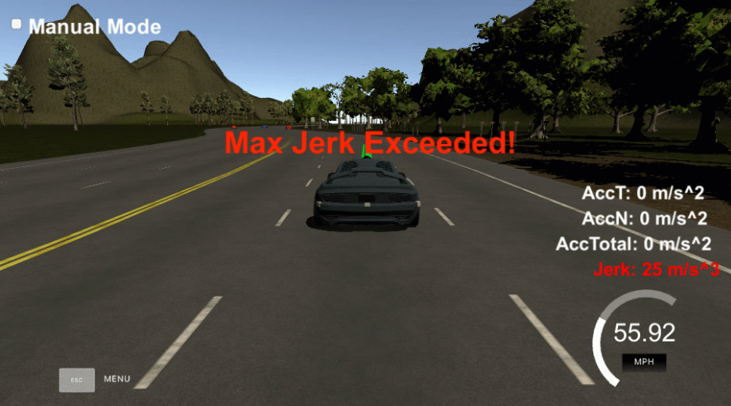
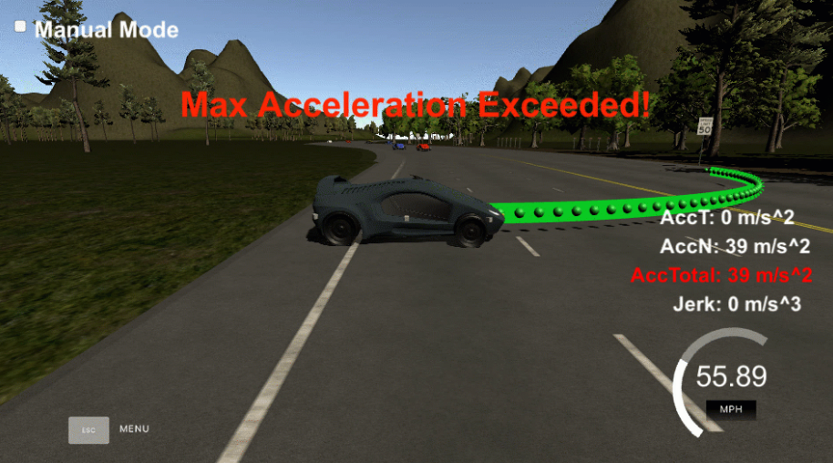
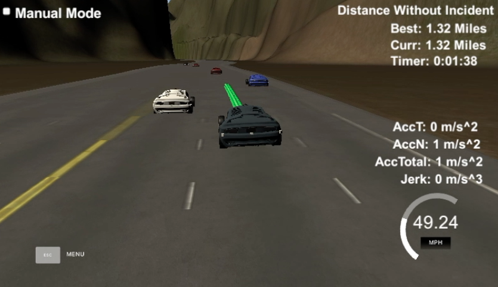
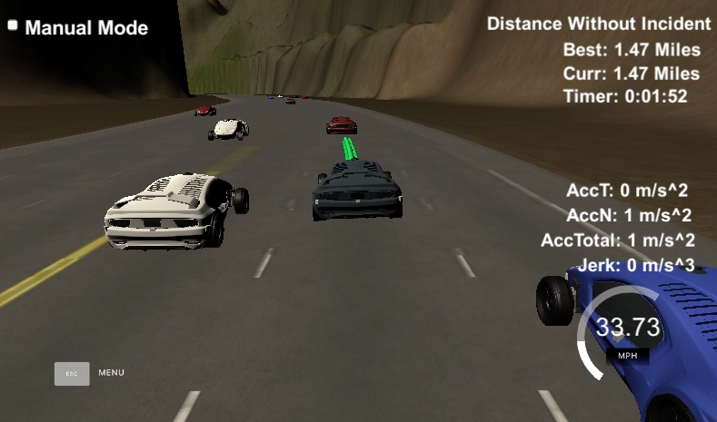
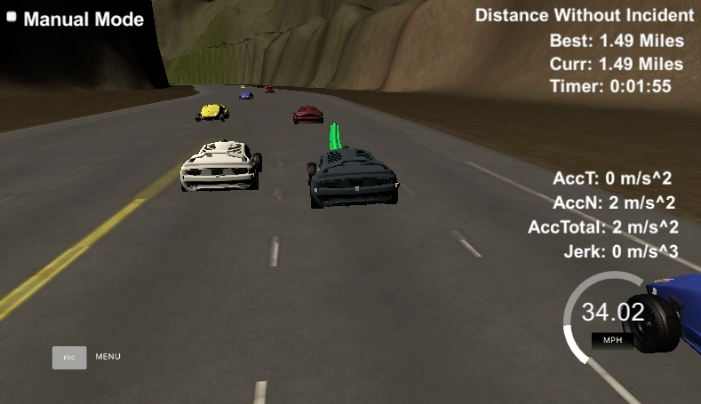

<<<<<<< HEAD


# Self-Driving Car Engineer Nanodegree Program by Udacity
## Project Portfolio - Neil Hiddink (2016-2017)

---

## Term 1 (October 2016 - January 2017)

### Project 1 - [Finding Lane Lines](https://github.com/nhiddink/SDCND_Portfolio_Hiddink/tree/master/term_1/1_finding_lane_lines)

[](https://www.youtube.com/watch?v=O0E0WWl6ooY)

### Project 2 - [Traffic Sign Classifier](https://github.com/nhiddink/SDCND_Portfolio_Hiddink/tree/master/term_1/2_traffic_sign_classifier)

### Project 3 - [Behavioral Cloning](https://github.com/nhiddink/SDCND_Portfolio_Hiddink/tree/master/term_1/3_behavioral_cloning)

[](https://www.youtube.com/watch?v=kuUtfNDPWpY)

### Project 4 - [Advanced Lane Finding](https://github.com/nhiddink/SDCND_Portfolio_Hiddink/tree/master/term_1/4_advanced_lane_finding)

[](https://www.youtube.com/watch?v=5ZKbpNY-rok)

### Project 5 - [Vehicle Detection and Tracking](https://github.com/nhiddink/SDCND_Portfolio_Hiddink/tree/master/term_1/5_vehicle_detection)

[](https://www.youtube.com/watch?v=Vx5GtROunzQ)

## Term 2 (February 2017 - May 2017)

### Project 1 - [Extended Kalman Filter](https://github.com/nhiddink/SDCND_Portfolio_Hiddink/tree/master/term_2/1_extended_kalman_filter)

### Project 2 - [Unscented Kalman Filter](https://github.com/nhiddink/SDCND_Portfolio_Hiddink/tree/master/term_2/2_unscented_kalman_filter)

### Project 3 - [Particle Filter](https://github.com/nhiddink/SDCND_Portfolio_Hiddink/tree/master/term_2/3_particle_filter)

### Project 4 - [PID Controller](https://github.com/nhiddink/SDCND_Portfolio_Hiddink/tree/master/term_2/4_pid_controller)

[](https://www.youtube.com/watch?v=jaYaLAodwUA)

### Project 5 - [Model Predictive Controller](https://github.com/nhiddink/SDCND_Portfolio_Hiddink/tree/master/term_2/5_mpc_controller)

[](https://www.youtube.com/watch?v=acJgKkmNRgs)

## Term 3 (July 2017 - Present)

### Project 1 - Path Planning

### Project 2 - Functional Safety

### Capstone - System Integration

=======


# Project 11 - Simulated Path Planning in C++

The goal of this project is to develop a path planner in C++ that can safely navigate around a virtual highway with other traffic that is driving at or below the 50 MPH speed limit. Specifically, the car must accomplish the following tasks:

+ **Speed Limit** - The car should try to go as close as possible to the 50 MPH speed limit, which means passing slower traffic when possible, note that other cars will try to change lanes too.

+ **Collisons** - The car should avoid hitting other cars at all cost as well as driving inside of the marked road lanes at all times, unless going from one lane to another.

+ **Distance Travelled** - The car should be able to make one complete loop around the 6946m highway. Since the car is trying to go 50 MPH, it should take a little over 5 minutes to complete 1 loop. 

+ **Acceleration & Jerk** - The car should not experience total acceleration over 10 m/s^2 and jerk that is greater than 50 m/s^3.

The car's localization and sensor fusion data is provided in addition to a sparse map list of waypoints around the highway. Each waypoint in the list contains [x, y, s, dx, dy] values. x and y are the waypoint's map coordinate position, the s value is the distance along the road to get to that waypoint in meters, the dx and dy values define the unit normal vector pointing outward of the highway loop. See [data/highway_map.csv](data/highway_map.csv) for more information.

The highway's waypoints are set up in an overlapping loop. Therefore, the frenet s value (the distance along the road) goes from 0 to 6945.554.

# Getting Started

+ The starter code for this project was taken from Udacity's . 

+ The Simulator used for this project can be downloaded [here] erm3 Simulator which contains the Path Planning Project from the [releases tab (https://github.com/udacity/self-driving-car-sim/releases).

### Basic Build Instructions

1. Clone this repo.
2. Make a build directory: `mkdir build && cd build`
3. Compile: `cmake .. && make`
4. Run it: `./path_planning`.

# Definitions

### Main Car's Localization Data (No Noise)

["x"] The car's x position in map coordinates

["y"] The car's y position in map coordinates

["s"] The car's s position in frenet coordinates

["d"] The car's d position in frenet coordinates

["yaw"] The car's yaw angle in the map

["speed"] The car's speed in MPH

### Previous Path Data

["previous_path_x"] The previous list of x points previously given to the simulator

["previous_path_y"] The previous list of y points previously given to the simulator

["end_path_s"] The previous list's last point's frenet s value

["end_path_d"] The previous list's last point's frenet d value

### Sensor Fusion Data

["sensor_fusion"] A 2d vector of cars and then that car's [car's unique ID, car's x position in map coordinates, car's y position in map coordinates, car's x velocity in m/s, car's y velocity in m/s, car's s position in frenet coordinates, car's d position in frenet coordinates. 

# Model Documentation

### Linear Path Planner


### Circular Path Planner


After implementing the starter code for linear and circular paths as shown above, several elements of the path planner needed to be developed further to obtain a fully functional system. Each of the major considerations are explained in detail below.

### h.OnMessage(...) Function Overview

The code model for generating paths is roughly based on the normal decision-making process of a human driver. The `h.OnMessage(...)` function handles all of the car's decisions of this nature. The following code snippets walk through the highlights of this function step-by-step:

#### **1. Declare Variables**

After declaring the car data variables explained in the **Definitions** section, several variables are declared to handle the reference velocity and position of the vehicle. Additionally, `prev_size` contains a status of the number of path points and `next_waypoint` keeps track of the nearest waypoint to the front of the vehicle, initialized to -1 since 0 refers a specific value.

```
double ref_vel = 49.5; //in mph

int prev_size = previous_path_x.size();

int next_waypoint = -1;
   
double ref_x = car_x;
double ref_y = car_y;
double ref_yaw = deg2rad(car_yaw);
```

#### **2. Find Next Waypoint**

The `prev_size` variable provides information on the size of the path points stored in the planner. The code generates a `next_waypoint` based on the size of `prev_size`, which depends on the reference variables defined in step 1 once the size is greater than 2.

```
if (prev_size < 2) {

next_waypoint = NextWaypoint(ref_x, ref_y, ref_yaw, map_waypoints_x, map_waypoints_y, map_waypoints_dx, map_waypoints_dy);

} else {

     ref_x = previous_path_x[prev_size - 1];
     double ref_x_prev = previous_path_x[prev_size - 2];
     ref_y = previous_path_y[prev_size - 1];
     double ref_y_prev = previous_path_y[prev_size - 2];
     ref_yaw = atan2(ref_y - ref_y_prev, ref_x - ref_x_prev);
     next_waypoint = NextWaypoint(ref_x, ref_y, ref_yaw, map_waypoints_x, map_waypoints_y, map_waypoints_dx, map_waypoints_dy);

     car_s = end_path_s;

     car_speed = (sqrt((ref_x - ref_x_prev) * (ref_x - ref_x_prev) + (ref_y - ref_y_prev) * (ref_y - ref_y_prev)) / 0.02) * 2.24;
}
```

**3. Check for Cars in The Current Lane**



This part of the code centers around the Frenet `d` value pulled from the `sensor_fusion` data. This value is very useful because it follows the centerline of each lane and can be used to easily compare the positions of other vehicles to our vehicle. The logic behind the first `if` statement checks the current lane to see if there are cars that share the same d value. If the d values are the same, then there is another vehicle ahead of our car in the current lane.

```
for (int i = 0; i < sensor_fusion.size(); i++) {

     float d = sensor_fusion[i][6];
     if(d < (2+4*lane+2) && d > (2+4*lane-2)) {
          double vx = sensor_fusion[i][3];
          double vy = sensor_fusion[i][4];
          double check_speed = sqrt(vx * vx + vy * vy);
          double check_car_s = sensor_fusion[i][5];

          // Use this to project points from previous points
          check_car_s += ((double)prev_size * 0.02 * check_speed);

          // SPEED HANDLING CODE GOES HERE
     }
}
```

**4. Slow Down to Match Car in Front**



When inserted in place of the comment "SPEED HANDLING CODE GOES HERE" in Step 3, the `if` statement below handles changing the car's speed based on the location of the vehicle in front of it (now that it knows one is present).

```
// Check for larger s values and s gap
if ((check_car_s > car_s) && ((check_car_s - car_s) < 30) && ((check_car_s - car_s) < minDist_s)) {
     
     minDist_s = (check_car_s - car_s);

     if ((check_car_s - car_s > 20)) {
          // Match check_car's speed
          ref_vel = check_speed * 2.24;
          change_lane = true;

     } else {

          // Begin reducing speed to check_car's speed
          ref_vel = check_speed * 2.24 - 5;
          change_lane = true;
     }
}
```

**5. Change Lanes to the Left or Right**



Finally, the model handles left or right lane changes using two similarly designed code snippets. The logic for executing a left lane change is shown. The `if` statement checks to see if the lane is occupied and the distance remaining between `next_waypoint` and `waypoint_change_lane` in terms of the map waypoints to smooth the transition into the next lane and avoid excess acceleration or jerk.

```
if (change_lane && ((next_waypoint - waypoint_change_lane) % map_waypoints_x.size() > 2)) {
     
     bool did_change_lane = false;

     if (lane != 0 && !did_change_lane) {
          
          bool lane_change_ok = true;
          
          for (int i = 0; i < sensor_fusion.size(); i++) {
               float d = sensor_fusion[i][6];
               if (d < (2 + 4 * (lane - 1) + 2) && d > (2 + 4 * (lane - 1) - 2)) {

                    double vx = sensor_fusion[i][3];
                    double vy = sensor_fusion[i][4];
                    double check_speed = sqrt(vx * vx + vy * vy);

                    double check_car_s = sensor_fusion[i][5];
                    check_car_s += ((double)prev_size * 0.02 * check_speed);
                    double dist_s = check_car_s - car_s;

                    if (dist_s < 20 && dist_s > -20) {
                         lane_change_ok = false;
                    }
          }
     }

     if (lane_change_ok) {
          did_change_lane = true;
          lane -= 1;
          waypoint_change_lane = next_waypoint;
     }
}
```

### Perfect Controller

To eliminate the need to implement a controller, the car uses a perfect controller and visits every (x,y) point it receives in the list every .02 seconds. The units for the (x,y) points are in meters and the spacing of the points determines the speed of the car. The vector going from a point to the next point in the list dictates the angle of the car. Acceleration both in the tangential and normal directions is measured along with the jerk, the rate of change of total Acceleration.

### Latency and Transitions

Some latency exists between the simulator running and the path planner returning a path; however, with optimized code this usually does not exceed 1 to 3 time steps. The simulator will continue using points that it was last given during a delay, so the transition is not always smooth. I chose to implement the spline library to combat this issue. After including spline.h in main.cpp, I use previous_path_x and previous_path_y to create new paths with smooth transitions provided by a spline.

# Dependencies

* cmake >= 3.5
 * All OSes: [click here for installation instructions](https://cmake.org/install/)
* make >= 4.1
  * Linux: make is installed by default on most Linux distros
  * Mac: [install Xcode command line tools to get make](https://developer.apple.com/xcode/features/)
  * Windows: [Click here for installation instructions](http://gnuwin32.sourceforge.net/packages/make.htm)
* gcc/g++ >= 5.4
  * Linux: gcc / g++ is installed by default on most Linux distros
  * Mac: same deal as make - [install Xcode command line tools]((https://developer.apple.com/xcode/features/)
  * Windows: recommend using [MinGW](http://www.mingw.org/)
* [uWebSockets](https://github.com/uWebSockets/uWebSockets)
  * Run either `install-mac.sh` or `install-ubuntu.sh`.
  * If you install from source, checkout to commit `e94b6e1`, i.e.
    ```
    git clone https://github.com/uWebSockets/uWebSockets 
    cd uWebSockets
    git checkout e94b6e1
    ```

# General Notes

+ The code in this repository roughly follows [Google's C++ style guide](https://google.github.io/styleguide/cppguide.html).
+ All of the code must be buildable with cmake and make.

# Final Results

The final results for the project can be found on YouTube by clicking below:

[](https://www.youtube.com/watch?v=i8Y7JJEjpBs)

# Future Plans

+ **MPC/PID Controller Implementation** - In the future, I would like to expand the functionality of this project to include either an MPC or a PID controller similar to the ones I built in previous projects.
>>>>>>> CarND_P11_Path_Planning/master
