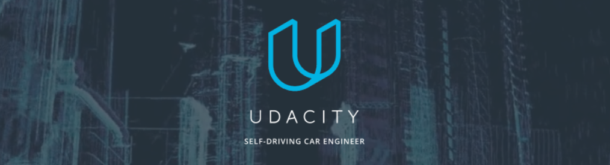

[//]: # (Image References)
[color_classification]: resources/output_images/color_classification.png
[color_distribution_visualization]: resources/output_images/color_distribution_visualization.png
[color_histograms_visualization]: resources/output_images/color_histograms_visualization.png
[data_visualization]: resources/output_images/data_visualization.png
[distortion]: resources/screenshots/distortion.png
[gradient_visualization]: resources/output_images/gradient_visualization.png
[heatmap]: resources/output_images/heatmap.png
[hog_classification]: resources/output_images/hog_classification.png
[hog_visualization]: resources/output_images/hog_visualization.png
[loading_screen]: resources/screenshots/loading_screen.png
[one_box_per_car]: resources/output_images/one_box_per_car.png
[random_image_visualization]: resources/output_images/random_image_visualization.png
[sliding_windows]: resources/output_images/sliding_windows.png
[spatial_binning_visualization]: resources/output_images/spatial_binning_visualization.png
[undistorted]: resources/output_images/undistorted.png
[undistorted_and_warped]: resources/output_images/undistorted_and_warped.png

# Project 5 - Vehicle Detection and Tracking in Video Feeds using Computer Vision

The software pipeline in SDCND_P5_Hiddink.ipynb is written to detect vehicles in a video stream. To accomplish this, the following steps were performed:
+ **Camera Calibration** - correct distortion due to the camera lens that was used to record the test videos. 
+ **Data Visualization** - understand the labeled data set as two labeled groups, "cars" and "not-cars".
+ **Feature Extraction** - apply five techniques, including histograms of color, color distribution, spatial binning, gradient magnitude, and Histogram of Oriented Gradients (HOG), on the labeled training set of images to create a feature vector.
+ **Preprocessing Data** - normalize, randomize, and split the labeled data into a training set, a validation set, and a testing set.
+ **Training** -  train a Linear SVM classifier on the labeled training set
+ **Sliding Windows** - implement a technique to search an image for vehicles using the trained classifier, and optimize the algorithm's efficiency by limiting the search area of the image and/or using heat maps that reject outliers of the positive windows.
+ **Video** - run a function using moviepy that estimates a bounding box for detected vehicles frame by frame.

Each of these steps is described in detail below.

## Camera Calibration

The code for this step is contained in Section I of SDCND_P5_Hiddink.ipynb.

![undistorted]

In order to account for distortion, the camera used to record the project video and shoot the test images needs to be calibrated. To do this, a series of chessboard images were introduced that displayed varying distortion angles. 

![distortion]

First, I define "object points", which represent the (x, y, z) coordinates of the chessboard corners in the world. I assume that the chessboard is fixed on the (x, y) plane at z=0, such that the object points are the same for each calibration image. Thus, objp is just a replicated array of coordinates, and objpoints is appended with a copy of it every time I successfully detect all chessboard corners in a test image. imgpoints is appended with the (x, y) pixel position of each of the corners in the image plane with each successful chessboard detection.

![undistorted_and_warped]

From there, I used the output objpoints and imgpoints to compute the camera calibration and distortion coefficients using the cv2.calibrateCamera() function. I applied this distortion correction to the test image using the cv2.undistort() function and obtained the result shown above. After successfully warping chessboard images, I was able to apply the undistort function to the test images and videos using a pickle file that stored the distortion matrix.

## Data Visualization

The following is a visualization of the first 10 images in the labeled dataset:

![data_visualization]

Each image is defined with either a "car" or "not-car" label. The labeled data sets used in this project are originally from the GTI Vehicle Image Database [GTI Vehicle Image Database](http://www.gti.ssr.upm.es/data/Vehicle_database.html), augmented by examples extracted from the project video itself. In the future, this repository will include images from the [KITTI Vision Benchmark Suite](http://www.cvlibs.net/datasets/kitti/) and the ecently released [Udacity Labeled Dataset](https://github.com/udacity/self-driving-car/tree/master/annotations), as described in the Future Plans section below.

## Feature Extraction

Several different techniques for feature extraction were used in Section 2 of  this project, including histograms of color, color distribution, spatial binning, gradient magnitude, and Histogram of Oriented Gradients (HOG). Each has its own effect on the feature vector that is produced, and when combined the techniques tend to improve the chosen classifier's performance.

### Histograms of Color

Histograms of color are used to analyze the raw pixel intensities of each color channel as features in the image. Given an image in RGB color space, color histograms of features return a concatenated feature vector based on the number of intensity bins and pixel intensity ranges.

![color_histograms_visualization]

### Color Distribution

Color distribution maps are useful in studying color values and locating clusters of color that correspond to objects of interest in an image. When plotting these maps in 3D, often the color distribution of objects of interest is conveniently clustered along a plane.

![color_distribution_visualization]

### Spatial Binning

Raw pixel values are useful to include in the feature vector when the desired objects in an image remain identifiable at low image resolutions, such as a car object.

![spatial_binning_visualization]

### Gradient Magnitude

Gradient magnitude is a technique used in previous computer vision projects (Projects 1 & 4) that applies a filter that represents the magnitude of the sobel-x and sobel-y gradients of odd-numbered pixel squares, such as 3x3 or 5x5.

![gradient_visualization]

### Histogram of Oriented Gradients (HOG)

HOG feature extraction is the most important technique utilized in this project. The scikit-image package has a built in function to handle HOG extraction, which is tuned by parameters including orientations, pixels_per_cell, and cells_per_block.

![hog_visualization]

The final feature extraction method that was implemented includes color histograms, spatial binning, and HOG, as shown in Sections 2 & 3. For HOG, the parameters were chosen as follows:

| Parameter       | Value   |
|:---------------:|:-------:| 
| orientations    | 9       |                                                                                 
| pixels_per_cell | (16,16) |
| cells_per_block | (4,4)   |
| visualise       | True    |
| feature_vector  | False   |

I chose these parameters for HOG after trial and error on test4.jpg. As shown in the visualization above, the parameters optimize the gradients, and work well for the heat map step later in the pipeline that limits the false positive classifications.

## Preprocessing Data

The training data was normalized, randomized, and split into training and testing sets, with 20% of the data reserved for the testing set.

## Training the SVC Classifier

After exploring feature extraction techniques, I trained a SVC classifier to classify the dataset as "car" or "not-car". On a consistent basis, the accuracy for this classifier was above 94%. To do this, I analyzed two different feature vectors and ran them through the classfier to produce the following results:

### Classification by Color and Spatial Binning
![color_classification]

### Classification by HOG
![hog_classification]

After comparing these two results, I decided to encorporate both of them as one feature vector that I retrained prior to running sliding windows on the test image, as explained next.

## Sliding Windows Search

![sliding_windows]

Section 3 of SDCND_P5_Hiddink.ipynb outlines my sliding windows approach to searching for vehicles in a test image with my SVC classifier. I decided to leave the scale at 1, but found that it performed well. I limited the search area to the bottom half of the image, minus the bottom 10%, for a total of 40% of the image to lower the total number of windows I needed to make. The parameters I chose for the sliding windows themselves are as follows: 

| Parameter  | Value             |
|:----------:|:-----------------:| 
| y_start    | image width x 0.5 |  
| y_stop     | image width x 0.9 |
| xy_window  | (64,64)           |
| xy_overlap | (0.85, 0.85)      |

These parameters produced the following results:

![positive_window_detections]

## Heatmap

The overlap of 0.85 allowed for a strong signature of positive window values on the actual cars that simplified the process of ruling out false positives with heat maps, as shown in the image below:

![heatmap]

After recording the positions of positive detections in each frame of the video, I created a heatmap and thresholded it to identify vehicle positions. I then used `scipy.ndimage.measurements.label()` to identify individual blobs in the heatmap. 

## Bounding Boxes

Assuming each cluster of positive windows corresponded to a vehicle, I constructed bounding boxes to cover the area of each blob detected. After detecting the correct amount of cars, I was able to combine the positive bounding boxes into one bounding box for each car:

![one_box_per_car]

## Final Results (YouTube)

A link to the final video output for this project is provided below. The code pipeline performs reasonably well on the entire video.

https://youtu.be/Vx5GtROunzQ

## Discussion

Firstly, The biggest challenge with this project was getting everything to work on a video stream. Due to the limitations of my laptop, a CPU, I was not able to troubleshoot the parameters as much as I would have liked, as each iteration of testing took a frustratingly long period of time. That said, I was able to find a few combinations of feature extraction parameters that performed better than others, and ultimately I realized the importance of spatial binning and HOG as two critical factors in creating a successful pipeline.

Secondly, I would also have figured out a way to smooth the vehicle detections from frame to frame. Perhaps some of my code would have run faster, and the overall output would be more desirable.

Lastly, the sliding window technique that I implemented was carried out for each frame, and HOG features were generated within each window, increasing processing time. Although I was able to produce a decent output, the code would have run faster had I run HOG features once as an array over the whole test image, then applied indexes of that array to each individual sliding window. Perhaps I will implement this concept in the future.

## Future Plans

+ **Include Additional Datasets**- I would like to implement Udacity's recently released dataset in the future. 

+ **Test Additional Classifiers**- Linear SVC was sufficient for this project, as it provided me with above 94% accuracy on a regular basis. However, if in the future I require a real-world system that must be able to classify cars on a human performance-level, I would need to experiment with other classifiers to improve past 94%.

+ **Add Lane Detection**- I would like to one day add my lane-finding algorithm from [Project 4 - Advanced Lane Detection](https://github.com/nhiddink/CarND_P4_Advanced_Lane_Finding) to perform simultaneous lane-finding and vehicle detection on a video.

+ **Test On Additional Videos**- One day I hope to implement this project on my own test videos.
